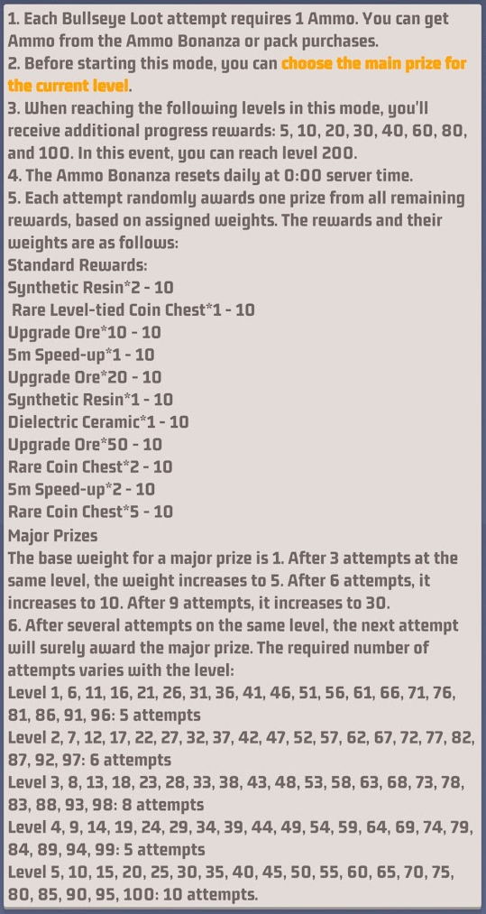
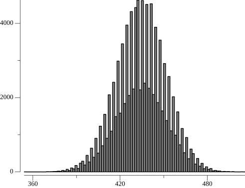
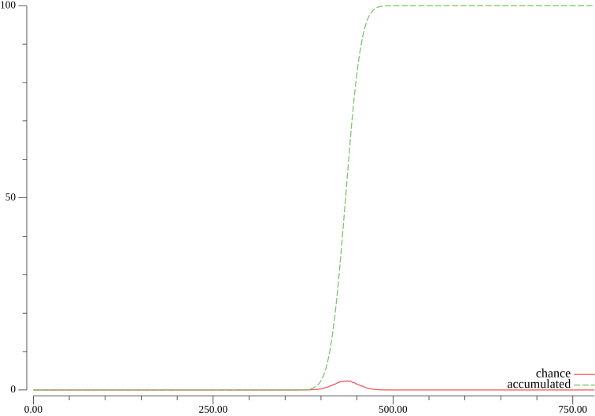

# bulletpoints
A small simulation for the bullseye loot event for the mobile game last war, written in go. In this event it is possible to gain 10 of the very rare mythical blue prints. However, one requires enough bullets to finish level 100.

The program is seeded and each run will return the same result. The simulation examines the result from 100000 runs from level 1 to 100.

(c) 2024 MeEatsBrains

## Considerations
The simulation uses the rules as specified in the game info.



The rule specify a  weight increase for a major prize after a few attemtps for each level and a certain win condition if a specific number of attempts have been made.

## Results
The histogram output of the simulation:


The propability output of the simulation:


The output:
```
starting simulation with 100000 runs
best case: 100 bullets
worst case: 780 bullets
average bullet count over 100000 simulations: 434.48365 bullets
now generating histo.png
now generating propability.png
chance of 10 % exceeded with 413 bullets
chance of 20 % exceeded with 420 bullets
chance of 30 % exceeded with 426 bullets
chance of 40 % exceeded with 430 bullets
chance of 50 % exceeded with 435 bullets
chance of 60 % exceeded with 439 bullets
chance of 70 % exceeded with 443 bullets
chance of 80 % exceeded with 449 bullets
chance of 90 % exceeded with 456 bullets
chance of 91 % exceeded with 457 bullets
chance of 92 % exceeded with 458 bullets
chance of 93 % exceeded with 460 bullets
chance of 94 % exceeded with 461 bullets
chance of 95 % exceeded with 462 bullets
chance of 96 % exceeded with 464 bullets
chance of 97 % exceeded with 466 bullets
chance of 98 % exceeded with 470 bullets
chance of 99 % exceeded with 474 bullets
```
