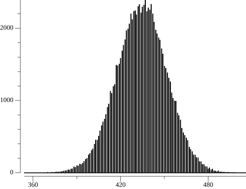

# bulletpoints
A small simulation for the bullseye loot event for the mobile game last war, written in go. In this event it is possible to gain 10 of the very rare mythical blue prints. However, one requires enough bullets to finish level 100.

The program is seeded and each run will return the same result. The simulation examines the result from 100000 runs from level 1 to 100.

(c) 2024-2025 MeEatsBrains

## Disclaimer
This simulation has been set up to the best knowledge of the author. Yet, I give no promises on the validity of the results.

As discussed in [a later section](#in-game-bugs-or-rule-alterations) real runs have been found to differ from the original version of the simulation. With two rule alterations it seems likely that the numbers match the in-game calculation.

## Considerations
The simulation uses the rules as specified in the game info.


The rule specify a weight increase for a major prize after a few attempts for each level and a certain win condition if a specific number of attempts have been made.

## In Game Bugs (or Rule Alterations?)
Players who partook in the event, reported numbers which exceeded the original expectation. bumchii kindly contributed the data of each stage of a run. The simulation has been modified since to include two changes which either contradict common expectations or the weight increase stated in rule #5.

A comparison of each individual group of stages of the first 1000 run simulations with the recorded run data has therefore been made.


It's quite obvious that the recorded data (green dots) exceed the expected values from the simulated distribution.

The rules don't state what happens to the minor price targets if they are hit. More bullets are of course needed if these targets stay in game. If one keeps the target active even after a hit one gets the following result:


This still overshoots the median value of the expectation in almost every case.

One can also try to skip the promised weight increase for major targets from rule #5.


Still more bullets are required than expected. If one combines both effects one gets:


This seems to match the simulation. I give no promises for the correctness of my results or the provided run data. I cannot claim correctness here and don't claim it's scam. But it seems to me one should use the simulation with these two rule alterations if one wants to draw any conclusions.

## Results
The histogram output of the simulation (with all rules in place as stated in-game):


The histogram output of the simulation (with both rules alterations):


The probability output of the simulation (with all rules in place as stated in-game):


The probability output of the simulation (with both rules alterations):


The output:
```
starting simulation with 100000 runs (following the rules as stated)
best case: 100 bullets
worst case: 780 bullets
average bullet count over 100000 simulations: 434.48365 bullets
now generating histo.png
now generating probability.png
chance of 10.0 % exceeded with 413 bullets
chance of 20.0 % exceeded with 420 bullets
chance of 30.0 % exceeded with 426 bullets
chance of 40.0 % exceeded with 430 bullets
chance of 50.0 % exceeded with 435 bullets
chance of 60.0 % exceeded with 439 bullets
chance of 70.0 % exceeded with 443 bullets
chance of 80.0 % exceeded with 449 bullets
chance of 90.0 % exceeded with 456 bullets
chance of 91.0 % exceeded with 457 bullets
chance of 92.0 % exceeded with 458 bullets
chance of 93.0 % exceeded with 460 bullets
chance of 94.0 % exceeded with 461 bullets
chance of 95.0 % exceeded with 462 bullets
chance of 96.0 % exceeded with 464 bullets
chance of 97.0 % exceeded with 466 bullets
chance of 98.0 % exceeded with 470 bullets
chance of 99.0 % exceeded with 474 bullets
chance of 99.1 % exceeded with 475 bullets
chance of 99.2 % exceeded with 475 bullets
chance of 99.3 % exceeded with 476 bullets
chance of 99.4 % exceeded with 477 bullets
chance of 99.5 % exceeded with 478 bullets
chance of 99.6 % exceeded with 479 bullets
chance of 99.7 % exceeded with 481 bullets
chance of 99.8 % exceeded with 483 bullets
chance of 99.9 % exceeded with 487 bullets
now loading recorded_run.csv
now generating run_comparison.png
=====================================

starting simulation with 100000 runs (alterations included in the ruleset: hit targets are not removed and can be hit again)
best case: 100 bullets
worst case: 780 bullets
average bullet count over 100000 simulations: 466.08128 bullets
now generating histo_targets_not_removed.png
now generating probability_targets_not_removed.png
chance of 10.0 % exceeded with 441 bullets
chance of 20.0 % exceeded with 450 bullets
chance of 30.0 % exceeded with 456 bullets
chance of 40.0 % exceeded with 461 bullets
chance of 50.0 % exceeded with 466 bullets
chance of 60.0 % exceeded with 471 bullets
chance of 70.0 % exceeded with 476 bullets
chance of 80.0 % exceeded with 482 bullets
chance of 90.0 % exceeded with 491 bullets
chance of 91.0 % exceeded with 492 bullets
chance of 92.0 % exceeded with 493 bullets
chance of 93.0 % exceeded with 495 bullets
chance of 94.0 % exceeded with 496 bullets
chance of 95.0 % exceeded with 498 bullets
chance of 96.0 % exceeded with 500 bullets
chance of 97.0 % exceeded with 502 bullets
chance of 98.0 % exceeded with 506 bullets
chance of 99.0 % exceeded with 511 bullets
chance of 99.1 % exceeded with 512 bullets
chance of 99.2 % exceeded with 513 bullets
chance of 99.3 % exceeded with 513 bullets
chance of 99.4 % exceeded with 515 bullets
chance of 99.5 % exceeded with 516 bullets
chance of 99.6 % exceeded with 517 bullets
chance of 99.7 % exceeded with 519 bullets
chance of 99.8 % exceeded with 522 bullets
chance of 99.9 % exceeded with 525 bullets
now loading recorded_run.csv
now generating run_comparison_targets_not_removed.png
=====================================

starting simulation with 100000 runs (alterations included in the ruleset: the promised increased chance to hit the major target is not honored)
best case: 100 bullets
worst case: 780 bullets
average bullet count over 100000 simulations: 543.404 bullets
now generating histo_weight_not_increased_as_promised.png
now generating probability_weight_not_increased_as_promised.png
chance of 10.0 % exceeded with 512 bullets
chance of 20.0 % exceeded with 523 bullets
chance of 30.0 % exceeded with 531 bullets
chance of 40.0 % exceeded with 537 bullets
chance of 50.0 % exceeded with 544 bullets
chance of 60.0 % exceeded with 550 bullets
chance of 70.0 % exceeded with 556 bullets
chance of 80.0 % exceeded with 564 bullets
chance of 90.0 % exceeded with 574 bullets
chance of 91.0 % exceeded with 576 bullets
chance of 92.0 % exceeded with 577 bullets
chance of 93.0 % exceeded with 579 bullets
chance of 94.0 % exceeded with 581 bullets
chance of 95.0 % exceeded with 583 bullets
chance of 96.0 % exceeded with 585 bullets
chance of 97.0 % exceeded with 588 bullets
chance of 98.0 % exceeded with 592 bullets
chance of 99.0 % exceeded with 599 bullets
chance of 99.1 % exceeded with 599 bullets
chance of 99.2 % exceeded with 600 bullets
chance of 99.3 % exceeded with 601 bullets
chance of 99.4 % exceeded with 603 bullets
chance of 99.5 % exceeded with 604 bullets
chance of 99.6 % exceeded with 606 bullets
chance of 99.7 % exceeded with 608 bullets
chance of 99.8 % exceeded with 611 bullets
chance of 99.9 % exceeded with 615 bullets
now loading recorded_run.csv
now generating run_comparison_weight_not_increased_as_promised.png
=====================================

starting simulation with 100000 runs (alterations included in the ruleset: hit targets are not removed and can be hit again, the promised increased chance to hit the major target is not honored)
best case: 100 bullets
worst case: 780 bullets
average bullet count over 100000 simulations: 582.91929 bullets
now generating histo_targets_not_removed_and_weight_not_increased_as_promised.png
now generating probability_targets_not_removed_and_weight_not_increased_as_promised.png
chance of 10.0 % exceeded with 550 bullets
chance of 20.0 % exceeded with 561 bullets
chance of 30.0 % exceeded with 570 bullets
chance of 40.0 % exceeded with 577 bullets
chance of 50.0 % exceeded with 583 bullets
chance of 60.0 % exceeded with 590 bullets
chance of 70.0 % exceeded with 597 bullets
chance of 80.0 % exceeded with 605 bullets
chance of 90.0 % exceeded with 616 bullets
chance of 91.0 % exceeded with 617 bullets
chance of 92.0 % exceeded with 619 bullets
chance of 93.0 % exceeded with 621 bullets
chance of 94.0 % exceeded with 623 bullets
chance of 95.0 % exceeded with 625 bullets
chance of 96.0 % exceeded with 628 bullets
chance of 97.0 % exceeded with 631 bullets
chance of 98.0 % exceeded with 635 bullets
chance of 99.0 % exceeded with 642 bullets
chance of 99.1 % exceeded with 642 bullets
chance of 99.2 % exceeded with 643 bullets
chance of 99.3 % exceeded with 645 bullets
chance of 99.4 % exceeded with 646 bullets
chance of 99.5 % exceeded with 647 bullets
chance of 99.6 % exceeded with 649 bullets
chance of 99.7 % exceeded with 651 bullets
chance of 99.8 % exceeded with 654 bullets
chance of 99.9 % exceeded with 659 bullets
now loading recorded_run.csv
now generating run_comparison_targets_not_removed_and_weight_not_increased_as_promised.png
=====================================
```

## Credits
My thanks goes to bumchii who recorded the whole real run and gave me the data! This helped a lot.